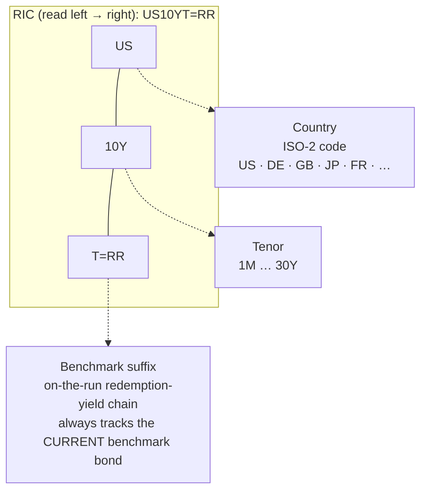

# Cash Government / Sovereign Bond Yield Curves (RIC-addressed, `get_history`)

On-the-run **benchmark government bond yields** — the cash sovereign curve you use for term-premium
work, rate-differential panels, and FX-vs-rates studies. This is a different route to a yield curve
than the swap family: instead of par swap rates it gives you the **redemption yield of the current
benchmark government bond** at each maturity. Everything below was **enumerated and validated live
via `get_history` / `search_instruments` on 2026-07-03**: **G10 in depth plus a broad EM and
euro-area-periphery set**, a tenor grid from **1M to 30Y**, **daily** history, and **multi-decade**
depth for the core markets. The forward-curve section is validated separately and in detail.

> **This family does NOT use `TR.*` fields.** Like the swap and FX families, a benchmark yield is an
> **instrument addressed by RIC** and read as a **rate time series with `get_history`**. There is one
> RIC per (country × tenor). You do not "select a `TR.` field"; you pick the right RIC and pull
> **`MID_YLD_1`** (the mid redemption yield). This is the single most important field in this file.

## How to address a benchmark yield (RIC anatomy)

A cash-benchmark RIC concatenates **ISO-2 country code + tenor + `T=RR`**. The `=RR` chain is LSEG's
**on-the-run benchmark redemption-yield** family; the RIC always points at whatever bond is *currently*
the benchmark for that country and maturity.



Worked examples (all observed live, mid yield in %):

| RIC | Decodes as | Live `MID_YLD_1` (2026-07-02) |
|---|---|---|
| `US10YT=RR` | United States, 10Y on-the-run | 4.484 |
| `DE10YT=RR` | Germany (Bund), 10Y | 2.898 |
| `GB10YT=RR` | United Kingdom (Gilt), 10Y | 4.776 |
| `JP10YT=RR` | Japan (JGB), 10Y | 2.771 |
| `FR10YT=RR` | France (OAT), 10Y | 3.702 |
| `IT10YT=RR` | Italy (BTP), 10Y | 3.678 |
| `ES10YT=RR` | Spain (Bono), 10Y | 3.393 |
| `CA10YT=RR` | Canada, 10Y | 3.443 |
| `AU10YT=RR` | Australia (ACGB), 10Y | 4.818 |
| `NZ10YT=RR` | New Zealand, 10Y | 4.453 |

The **country code is ISO-2, not a currency code** (`GB` not UK, `JP`, `DE`, …). Each euro-area
sovereign has its own `=RR` chain (they share the euro but are separate issuers): `DE`, `FR`, `IT`,
`ES`, `NL`, `BE`, `PT`, `GR` all validated live. To confirm a code before pulling history, search
rather than guess:

```python
ld.discovery.search(
    query="Canada 10 year benchmark government bond",
    view="SearchAll",
    select="RIC, DocumentTitle",
)
```

## The yield field: `MID_YLD_1` (NOT `YLDTOMAT`)

Calling `get_history` on a `=RR` RIC with no `fields` returns **~37 columns**. The one you almost
always want is **`MID_YLD_1`** — the mid redemption yield in percent. There is a near-twin,
`YLDTOMAT`, that prints an almost identical number on liquid markets (US 10Y: `MID_YLD_1` 4.4801 vs
`YLDTOMAT` 4.4811 — a ~0.1 bp gap), **but `YLDTOMAT` silently drops out on several markets where
`MID_YLD_1` populates**. Validated live: on 2026-07-02 `YLDTOMAT` came back **null for South Africa
(`ZA10YT=RR`) and Brazil (`BR10YT=RR`)**, while `MID_YLD_1` returned 8.39 and 14.66 respectively.
**Standardise on `MID_YLD_1`** for any cross-country panel; treat `YLDTOMAT` as a same-value fallback
that is patchier at the EM edge.

## Fields returned by `get_history`

A `=RR` benchmark page is rich — as well as the yield it carries the underlying bond's **price, cash,
risk analytics, and a full spread block** for free. Default (no-`fields`) call on `US10YT=RR`, grouped:

| Group | Field codes | Meaning |
|---|---|---|
| **Yield (use this)** | `MID_YLD_1` | **Mid redemption yield, %** — the curve value you want |
| Yield, other | `YLDTOMAT`, `A_YLD_1` / `B_YLD_1`, `ISMA_A_YLD` / `ISMA_B_YLD`, `OPEN_YLD` / `HIGH_YLD` / `LOW_YLD` | Yield-to-maturity; ask/bid yield; ISMA (annual) ask/bid; session open/high/low yield |
| Price | `MID_PRICE`, `BID` / `ASK`, `CLEAN_PRC`, `DIRTY_PRC`, `OPEN_BID` / `OPEN_ASK`, `BID_HIGH_1` / `BID_LOW_1` / `ASK_HIGH_1` / `ASK_LOW_1` | Mid clean price (≈`CLEAN_PRC`); two-way price; clean vs dirty; session open/intraday hi-lo |
| Cash | `ACCR_INT` | Accrued interest |
| Risk analytics | `MOD_DURTN`, `CONVEXITY`, `BPV` | Modified duration (~7.9 at 10Y), convexity, basis-point value |
| Spreads | `AST_SWPSPD`, `ASP1M` / `ASP3M` / `ASP6M`, `SWAP_SPRDB`, `OIS_SPREAD`, `ZSPREAD`, `OAS_BID`, `BMK_SPD`, `INT_BASIS`, `INT_CDS`, `TED_SPREAD` | Asset-swap spread and 1/3/6M par variants; swap spread; spread to OIS; Z-spread; option-adjusted spread; benchmark spread (0 on the benchmark itself); bond-CDS basis |

Two things to note:

- **No coupon / maturity / ISIN on the history page.** `COUPN_RATE`, `MATUR_DATE`, `ISSUE_DATE`,
  `SEC_DESC` are **silently dropped** from a `get_history` call — the only cash-flow field carried is
  `ACCR_INT`. Static bond attributes (coupon, maturity, ISIN) are **reference data**: fetch them with
  `ld.get_data(...)` using `TR.Fi*` fields (`TR.FiCouponRate`, `TR.FiMaturityDate`, `TR.ISIN`, …).
  *(Not re-validated on this run — the reference `get_data` calls hit the account rate limit; the
  history-side behaviour above is confirmed.)* Because the `=RR` RIC **rolls** to a new bond over
  time, these attributes are not stable down a long history — see the roll gotcha below.
- **`TED_SPREAD` was all-null** on the test window (dropped with a warning) — the account/market
  combination did not populate it.

## Tenor grid & coverage matrix

The full ladder probed is **1M, 3M, 6M, 1Y, 2Y, 3Y, 5Y, 7Y, 10Y, 15Y, 20Y, 30Y**. Hold the country
code, swap the tenor token (`US2YT=RR`, `US5YT=RR`, …). The **US grid is fully validated**; other
countries were spot-checked at 2Y / 5Y / 10Y / 30Y. ✅ = returned data, ✗ = null across the window
(genuine gap), blank = not individually probed (assume present — the belly is standard).

| Country | 1M | 3M | 6M | 1Y | 2Y | 3Y | 5Y | 7Y | 10Y | 15Y | 20Y | 30Y |
|---|:--:|:--:|:--:|:--:|:--:|:--:|:--:|:--:|:--:|:--:|:--:|:--:|
| **US** | ✅ | ✅ | ✅ | ✅ | ✅ | ✅ | ✅ | ✅ | ✅ | **✗** | ✅ | ✅ |
| DE | | | | | ✅ | | ✅ | | ✅ | | | ✅ |
| GB | | | | | ✅ | | ✅ | | ✅ | | | ✅ |
| JP | | | | | ✅ | | ✅ | | ✅ | | | ✅ |
| FR / IT / ES | | | | | ✅ | | | | ✅ | | | ✅ |
| CA / AU / CH | | | | | ✅ | | | | ✅ | | | ✅ |
| NZ | | | | | ✅ | | ✅ | | ✅ | | | **✗** |
| **NO** | | | | | **✗** | | ✅ | | ✅ | | | **✗** |
| MX / ZA / KR / IN | | | | | | | ✅ | | ✅ | | | ✅ |
| CN | | | | | | | | | ✅ | | | ✅ |
| **BR** | | | | | | | | | ✅ | | | **✗** |
| **PL** | | | | | ✅ | | | | ✅ | | | **✗** |

**Validated gaps worth knowing (all confirmed null across a multi-day window, not a one-day miss):**

- **US has no 15Y** benchmark (`US15YT=RR` null every day) — the Treasury does not run a 15Y
  on-the-run. Use 10Y and 20Y around it.
- **New Zealand and Norway have no 30Y**, and **Norway also has no 2Y** — Norway's on-the-run grid is
  unusually sparse for a G10 name (validated points: 5Y, 10Y; no 2Y, no 30Y).
- **Brazil and Poland have no 30Y** on-the-run benchmark.

## Country / currency coverage

The `=RR` family is broad — well beyond G10. Below, each country's 10Y RIC and a live `MID_YLD_1`
print (2026-07-02) as evidence the chain resolves. Swap the tenor token to walk the curve.

| Region | Country (10Y RIC) — live mid yield % |
|---|---|
| **G10 core** | US `US10YT=RR` 4.48 · DE `DE10YT=RR` 2.90 · GB `GB10YT=RR` 4.78 · JP `JP10YT=RR` 2.77 · FR `FR10YT=RR` 3.70 · CA `CA10YT=RR` 3.44 · AU `AU10YT=RR` 4.82 · NZ `NZ10YT=RR` 4.45 · CH `CH10YT=RR` 0.30 · NO `NO10YT=RR` 4.30 |
| **Euro-area / periphery** | IT `IT10YT=RR` 3.68 · ES `ES10YT=RR` 3.39 · NL `NL10YT=RR` 3.02 · BE `BE10YT=RR` 3.47 · PT `PT10YT=RR` 3.28 · GR `GR10YT=RR` 3.58 |
| **Other Europe** | SE `SE10YT=RR` 2.73 |
| **Major EM** | MX `MX10YT=RR` 8.97 · BR `BR10YT=RR` 14.66 · ZA `ZA10YT=RR` 8.39 · PL `PL10YT=RR` 5.21 · KR `KR10YT=RR` 4.18 · IN `IN10YT=RR` 6.72 · CN `CN10YT=RR` 1.74 |

**EM benchmarks update less punctually.** Several EM points (`IN`, `MX`, `BR`, `PL`, `CN`) were null on
individual days inside the test window and populated on the next — a posting lag, not a coverage gap.
**Always pull a small window and take the last non-null**, rather than querying a single as-of date.

## Historical depth (by tier)

Daily depth of `MID_YLD_1` on the 10Y, verified live with yearly-interval probes:

| Tier | Countries | Daily history starts | Notes |
|---|---|---|---|
| **Deepest** | JP | **~1985** | `JP10YT=RR` prints from 1985 (5.55%). |
| **Deep** | DE | **~1990** | Bund from 1990 (9.00%); stitched across the D-mark → euro transition. |
| **Core** | US, GB | **~1994** | US 7.83% / GB 8.71% at 1994; continuous thereafter. |
| **EM / periphery** | most others | **2000s** | Populate from the 2000s; individual points fill in as issuance deepens. |

**Frequency:** daily (business days); `interval` also accepts `weekly` / `monthly` / `quarterly` /
`yearly`. **T-1 availability** — the latest end-of-day yield usually posts the next business day, so a
query up to "today" may miss the final bar.

## Forward curves

This is the section for term-premium and forward-rate work, and LSEG gives you **three ready-made,
Refinitiv-computed government-curve families** plus the raw material to build forwards yourself. All
RICs below were validated live.

### (a) Ready-made government curve chains

Unlike the swap family (where LSEG ships only par rates and you bootstrap the zero curve yourself),
the **government curves come pre-fit** — including the zero curve and the forward curve as first-class
instruments:

| Curve | RIC pattern | Chain root (example) | Value field(s) | Grid |
|---|---|---|---|---|
| **Par curve** (constant-maturity) | `{CC}GOVP{tenor}=R` | `0#GBGOVPBMK=R` | **`PAR_YLD1`** (par yield) **and `ZERO_YLD1`** (zero/spot yield) — both on one page | 1M, 3M, 6M, 9M, 1Y…12Y, 15Y, 30Y, 35Y, 50Y |
| **Zero-coupon curve (US)** | `USZCY{n}=FBNY` | `0#USZCY=FBNY` | **`TRDPRC_1`** (zero yield, %) | integer years 1Y … 30Y |
| **Forward par curve** | `{CC}GOV{start}F{tenor}=R` | `0#USGOV5YFBMK=R` | **`PAR_YLD1`** (forward par yield) **and `DISC_FACT`** (forward discount factor) | forward starts 1M…25Y × tenor points |
| **Forward YTM curve (China)** | `CN{n}YTF=CFXS` | `0#CNTBFBMK=CFXS` | `REF_YIELD` (forward yield, %) | ½-year grid 1Y … 10Y+ |

Key points, all validated:

- **The par curve is the cleanest single source for a zero curve.** `GBGOVP10Y=R` returns
  `PAR_YLD1` 4.861 **and** `ZERO_YLD1` 4.957 in one call — the zero (spot) yield is handed to you, so
  **no coupon bootstrapping is needed**. Confirmed for the US (`USGOVP10Y=R`), Germany
  (`DEGOVP10Y=R`), Japan (`JPGOVP10Y=R`) and the UK — the `{CC}GOVP{tenor}=R` pattern is general.
  This is a smoothed **constant-maturity** fit, so it avoids the on-the-run roll jumps that afflict the
  raw `=RR` series (DE 10Y: par-curve 2.937 vs `=RR` on-the-run 2.946 — a ~1 bp model-vs-traded gap).
  Daily history reaches back to **at least 2000** (validated on `USGOVP10Y=R`).
- **`USZCY{n}=FBNY`** is the US Treasury zero-coupon curve as published by the **NY Fed** (the
  Gürkaynak-Sack-Wright / GSW-style curve), one point per integer year 1–30. Its value lives in
  **`TRDPRC_1`**, not `MID_YLD_1` (e.g. `USZCY10=FBNY` = 4.49). It **posts with a few-day lag** (the
  most recent business days can be null) — fine for research, but not a same-day series.
- **Forward par curves are a Refinitiv product**: `0#USGOV{start}FBMK=R` is the "{start}-forward
  government par curve", with constituents `USGOV{start}F{tenor}=R`. Validated for the US, Germany
  (`DEGOV5YF5Y=R`) and the UK (`GBGOV5YF5Y=R`) — so `{CC}GOV{start}F{tenor}=R` generalises across the
  majors. Each node carries `PAR_YLD1` (the forward yield) and `DISC_FACT` (the forward discount
  factor). So the **5y5y forward** is simply `USGOV5YF5Y=R` and the **1y1y forward** is
  `USGOV1YF1Y=R` — no computation required.
- **China** additionally exposes exchange-traded forward YTM curves via CFETS (`CN{n}YTF=CFXS`,
  field `REF_YIELD`), plus Refinitiv "Forward YTM Yield Curve" chains (`0#CFTBFYBMK=`,
  `0#CCBFYBMK=`).

### (b) Constructing implied forwards from the spot curve (with a worked, cross-checked example)

If you want the forward yourself (or need a country without a ready-made forward chain), start from
the **zero (spot) yields** `ZERO_YLD1` on the par curve. The `T1×T2` implied forward — the annualised
rate for the period from `T1` to `T2`, quoted with annual compounding — is:

```
(1 + z_T2)^T2  =  (1 + z_T1)^T1  ×  (1 + f)^(T2 − T1)

            [ (1 + z_T2)^T2 ] ^ ( 1 / (T2 − T1) )
   f_T1,T2 = [ ------------- ]                      − 1
            [ (1 + z_T1)^T1 ]
```

where `z_T` is the zero-coupon yield to maturity `T`. (If you only have **par** yields — e.g. from the
`=RR` on-the-run bonds — you must first bootstrap them to zeros; the `{CC}GOVP{tenor}=R` par curve
saves you that step by giving `ZERO_YLD1` directly.)

**Worked example — US, as of 2026-07-02.** Pull the spot zeros and compute the 1y1y and 5y5y forwards,
then cross-check against the ready-made forward RICs:

```python
import lseg.data as ld
ld.open_session()

# 1. spot zero yields from the Refinitiv par curve (ZERO_YLD1), in %
zc = {t: ld.get_history(f"USGOVP{t}=R", fields=["ZERO_YLD1"],
                        start="2026-07-02", end="2026-07-02")["ZERO_YLD1"].iloc[0]
      for t in ["1Y","2Y","5Y","10Y"]}
# zc = {1Y: 4.1059, 2Y: 4.1915, 5Y: 4.2968, 10Y: 4.5686}

def fwd(zT1, T1, zT2, T2):                     # annual-compounding forward, %
    zT1, zT2 = zT1/100, zT2/100
    return (((1+zT2)**T2 / (1+zT1)**T1) ** (1/(T2-T1)) - 1) * 100

f_1y1y = fwd(zc["1Y"], 1, zc["2Y"],  2)        # -> 4.277 %
f_5y5y = fwd(zc["5Y"], 5, zc["10Y"], 10)       # -> 4.842 %

# 2. cross-check against LSEG's ready-made forward par curve (PAR_YLD1)
chk_1y1y = ld.get_history("USGOV1YF1Y=R", fields=["PAR_YLD1"],
                          start="2026-07-02", end="2026-07-02")["PAR_YLD1"].iloc[0]   # 4.278
chk_5y5y = ld.get_history("USGOV5YF5Y=R", fields=["PAR_YLD1"],
                          start="2026-07-02", end="2026-07-02")["PAR_YLD1"].iloc[0]   # 4.829
ld.close_session()
```

| Forward | Bootstrapped from zeros (`ZERO_YLD1`) | Ready-made `PAR_YLD1` RIC | Gap |
|---|---|---|---|
| **1y1y** | 4.277 % | `USGOV1YF1Y=R` → 4.278 % | ~0 bp |
| **5y5y** | 4.842 % | `USGOV5YF5Y=R` → 4.829 % | ~1.3 bp |

The 1y1y matches to a fraction of a basis point. The 5y5y differs by ~1 bp because the bootstrap
produces a **zero (spot) forward** while the ready-made RIC is a **par forward** — on an upward-sloping
curve the par forward sits just below the zero forward. For a term-premium decomposition **be explicit
about which you want**: `ZERO_YLD1`-based zeros give zero forwards (the natural object for expectations
+ term-premium accounting); `PAR_YLD1` gives par forwards.

### (c) When to use this vs the swap forward curve

| Use the government forward curve (this file) when… | Use the swap forward curve (`swap-rates.md`) when… |
|---|---|
| You want the **risk-free / sovereign** term structure and its expectations + term-premium split | You want the **funding / OIS** curve or a projection-leg IBOR forward |
| You are decomposing a **government** benchmark yield (ACM, term premium, forward guidance) | You are pricing a **derivative** or discounting collateralised cash flows |
| You need a country's own sovereign curve (each euro member separately) | You need the currency-level swap/OIS curve (one per currency) |

The government forward par curve and the swap forward curve answer different questions — the spread
between them is the **asset-swap / swap spread** (carried as `AST_SWPSPD` / `SWAP_SPRDB` on the `=RR`
page and `SWAP_SPRD` on the par-curve page).

## Access patterns

**1. One benchmark yield, as a time series:**

```python
import lseg.data as ld
ld.open_session()
df = ld.get_history(
    universe="US10YT=RR",
    fields=["MID_YLD_1"],
    start="1994-01-01", end="2026-07-02",
    interval="daily",
)
ld.close_session()
```

**2. A cross-section of countries at one tenor — multi-RIC works here (unlike swaps/FX).** Passing
several `=RR` RICs with a **single field** returns a tidy **wide frame, one column per RIC**:

```python
df = ld.get_history(
    universe="US10YT=RR, DE10YT=RR, GB10YT=RR, JP10YT=RR, FR10YT=RR",
    fields=["MID_YLD_1"],           # ONE field -> wide, one column per country
    start="2026-06-25", end="2026-07-02",
)
# columns: Date, US10YT=RR, DE10YT=RR, GB10YT=RR, JP10YT=RR, FR10YT=RR
```

> **Wide-frame quirks.** (i) The response carries a harmless
> `"Requested fields not found: ['MID_YLD_1']"` warning — the values *are* `MID_YLD_1`, the label just
> moves to the RIC. (ii) When the RICs have **different coverage** (one has a null day), the wide
> alignment can inject a spurious null into an otherwise-populated column — sanity-check, or pull the
> questionable RIC on its own. (iii) Ask for **one field only** in the multi-RIC form; single-RIC
> calls can take a field list.

**3. A whole curve for one country** — hold the country code, iterate the tenor:

```python
tenors = ["1M","3M","6M","1Y","2Y","3Y","5Y","7Y","10Y","20Y","30Y"]   # US: no 15Y
curve = ld.get_history(
    universe=", ".join(f"US{t}T=RR" for t in tenors),
    fields=["MID_YLD_1"], start="2026-06-30", end="2026-07-02",
)
```

**4. Long histories:** the series are decades deep and daily — chunk by date range and persist
(`df.to_parquet(...)`) rather than holding a multi-country multi-decade frame in memory.

## Notes / gotchas

- **`MID_YLD_1`, not `YLDTOMAT`.** They agree to ~0.1 bp on liquid markets, but `YLDTOMAT` drops out
  on some EM benchmarks (validated null for ZA, BR) where `MID_YLD_1` populates. Standardise on
  `MID_YLD_1`.
- **The benchmark ROLLS — a long `=RR` history splices across successive bonds.** `US10YT=RR` is not a
  single instrument: it always tracks *today's* on-the-run 10Y, so its multi-year `MID_YLD_1` series is
  a chain of different bonds with different coupons and exact maturities. This is exactly what you want
  for a **constant-maturity** yield series, but do **not** treat it as one bond — its coupon/maturity
  are not stable, and small yield "jumps" at auction/roll dates are the benchmark changing, not a data
  error. For a genuinely smooth constant-maturity curve free of roll artefacts, prefer the
  Refinitiv **par curve** `{CC}GOVP{tenor}=R`.
- **Coupon / maturity / ISIN are not on the history page** — they are silently dropped from
  `get_history` (only `ACCR_INT` survives). Pull them as reference data via `ld.get_data(...)` with
  `TR.Fi*` fields.
- **Validated tenor gaps:** US has no 15Y; NZ and Norway have no 30Y (and Norway no 2Y); Brazil and
  Poland have no 30Y. Probe the long/short end before assuming a point exists.
- **EM and some euro points post with a lag** — pull a small window and take the last non-null rather
  than a single as-of date. The NY Fed zero curve (`USZCY*=FBNY`) lags a few days in particular.
- **The zero curve field is `TRDPRC_1`; the par-curve fields are `PAR_YLD1` / `ZERO_YLD1`; the forward
  par-curve fields are `PAR_YLD1` / `DISC_FACT`; the China forward field is `REF_YIELD`.** Each family
  has its own value field — don't assume `MID_YLD_1` everywhere.
- **T-1 availability** and **silent field drops** apply as everywhere in LSEG — an invalid/unentitled
  field is omitted from the result rather than raising; always inspect the returned columns.
- **Related families:** par swap / OIS curves (the derivative route to a yield curve) are in
  [swap-rates.md](swap-rates.md); fixed-income **index** benchmarks (`TR.Benchmark*`) are in
  [benchmarks.md](benchmarks.md). Use the government `=RR` / `GOVP` families here for the **cash
  sovereign** curve.
