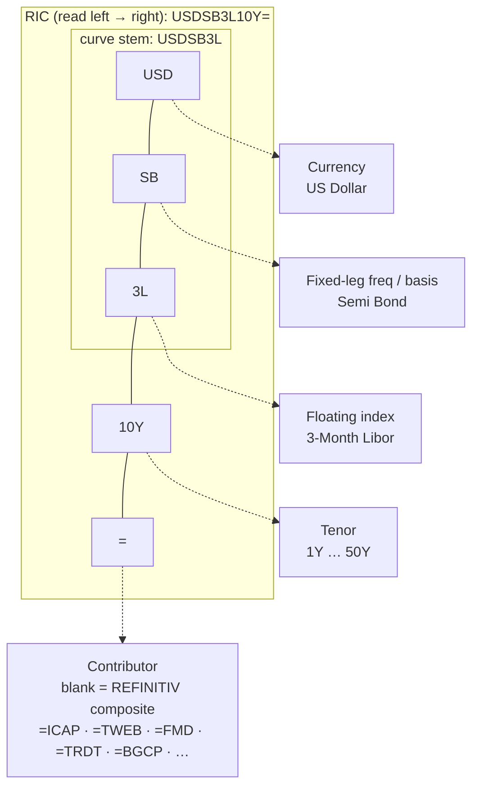

# Interest Rate Swaps & Swap Curves (RIC-addressed, `get_history`)

Par swap rates and overnight-index-swap (OIS) rates for building **discount curves and yield
curves** across currencies and tenors. This is LSEG's **OTC Interest Rate Derivatives** universe
plus the individual broker/venue contributor pages. Coverage was enumerated live from the MCP
(`search_instruments` + `get_history`) on **2026-07-02**: **40+ currencies**, a **granular annual
tenor grid out to 50 years**, **daily** history, and **multi-decade** depth for the core currencies.

> **This family does NOT use `TR.*` fields.** Unlike funds or fundamentals, a swap curve is *not*
> a `get_data` field code — it is an **instrument addressed by RIC** and read as a **price/rate
> time series with `get_history`**. There is one RIC per (currency × convention × tenor). You do
> not "select a field"; you pick the right RIC and pull `MID_PRICE`.

> **Entitlement / access caveat.** OTC rates are contributor-licensed. The **`REFINITIV`
> composite** pages (bare `=` suffix, e.g. `USDSB3L10Y=`) are the broadly entitled default and the
> clean series to use. Named-contributor pages (`=ICAP`, `=TWEB`, `=FMD`, `=TRDT`, `=BGCP`, …) may
> be denied or return `The universe is not found` depending on subscription. A denial on a
> contributor page is a licensing gap, not a bad query — fall back to the composite.

## How to address a swap curve (RIC anatomy)

A swap RIC concatenates **currency + leg convention + floating index + tenor + `=` + optional
contributor**. Decode by chunks:



Worked examples (all observed live):

| RIC | Decodes as |
|---|---|
| `USDSB3L10Y=` | USD, Semi Bond vs **3M Libor**, 10Y — the USD IBOR-swap workhorse |
| `EURAB6E10Y=` | EUR, Annual Bond vs **6M Euribor**, 10Y — the EUR workhorse |
| `EURAB3E10Y=` | EUR, Annual Bond vs **3M Euribor**, 10Y (the 3M-index variant) |
| `GBPSB6L10Y=` | GBP, Semi Bond vs **6M Libor**, 10Y |
| `JPYSB6L10Y=` | JPY, Semi Bond vs **6M Libor**, 10Y |
| `CHFAB6L10Y=` | CHF, Annual Bond vs 6M Libor, 10Y |
| `USD10YOIS=` | USD, **10Y OIS** (Fed Funds) |
| `GBP10YOIS=` | GBP, **10Y OIS** (SONIA) |
| `EUREST10Y=` | EUR, **10Y OIS** (€STR / ESTR) |

The floating-index letters vary by market (`3L`/`6L` = 3M/6M Libor, `6E`/`3E` = 6M/3M Euribor,
`3BA` = Canadian 3M Bankers' Acceptances, `6AB`/`3AB` = Australian bank bills, `3S` = Swedish Stibor,
`6O` = Norwegian Nibor, `7R`/`3S` = Chinese repo/Shibor, etc.). You rarely need to build these by
hand — use `search_instruments` (below) to discover the exact stem for a currency, then swap the
tenor token.

## Curve types available

LSEG carries several **distinct curves per currency** — this matters, because modern pricing uses
one curve to project cash flows and another to discount:

| Curve type | What it is | Example RICs | Use for |
|---|---|---|---|
| **IBOR swap (IRS)** | Fixed vs IBOR (Libor/Euribor/Stibor/…) par rates | `USDSB3L10Y=`, `EURAB6E10Y=`, `GBPSB6L10Y=` | Long-history yield curve; projection leg |
| **OIS (RFR)** | Fixed vs overnight risk-free rate | `USDSROIS10Y=` (SOFR), `GBP10YOIS=` (SONIA), `EUREST10Y=` (€STR), `JPY10YOIS=` (TONAR), `CHF10YOIS=` (SARON) | Modern **discount curve**; collateralised valuation |
| **Tenor basis swap** | Spread between two floating indices | `USDSR3LBS=` (SOFR vs 3M Libor), `EUR1E3EBS=TWEB` | Cross-index adjustments |
| **Cross-currency basis** | FX-linked funding spread | `EURCBS=`, `JPYCBS=`, `GBPCBS=`, `EUUSESSRBS=` (€STR/SOFR) | CIP deviations, XCCY discounting |
| **Cross-currency IRS** | Full fixed/float swap across two currencies | `CNUSCS=CFXF`, `EUUSAB3LCS=FMD` | Hedged foreign funding |
| **Constant Maturity Swap (CMS)** | Swap rate paid as a floating index | `EUR10CMS=ICAP` | Curve-shape / convexity products |

For a plain **discount curve / yield curve**, you want the **IBOR swap** family (deep history) and/or
the **OIS/RFR** family (modern discounting). The other three are spreads layered on top.

## Tenor grid (granularity)

Each currency exposes a **granular annual grid** — one RIC per tenor — from which the curve is fit:

```
Short end (money market / FRA, often separate RICs):  1M 2M 3M 6M 9M
Swap grid (annual):                                   1Y 2Y 3Y 4Y 5Y 6Y 7Y 8Y 9Y 10Y
Long end:                                             12Y 15Y 20Y 25Y 30Y 40Y 50Y
```

- **Build a whole curve** by holding the stem fixed and iterating the tenor token
  (`USDSB3L1Y=`, `USDSB3L2Y=`, … `USDSB3L50Y=`). See "Access patterns" for the one-RIC-per-call rule.
- **The grid deepens at the belly first.** The tenor points do not all start on the same day — the
  liquid belly has the longest history and the wings were added later. Verified USD (`USDSB3L*`)
  start years:

  | Tenor | USD IBOR-swap history starts |
  |---|---|
  | 2Y, 5Y, 10Y, 15Y, 20Y (and 30Y) | **2002** |
  | 40Y | **2009** |
  | 1Y, 50Y | **2010** |

  So the **2Y–30Y core is continuous from 2002**; the 1Y and the 40Y/50Y wings only fill in from
  2009–2010. Plan a fixed-grid panel around the tenors that actually co-exist over your sample.
- The **sub-1Y** points (1M–9M) at the very front come from the deposit/FRA side of the same market
  page family, not always from the `…3M=`-style swap RIC; for a full discount curve you typically
  splice money-market rates + FRAs + swaps.

## Currency coverage

A single snapshot of just the **10Y point** returned instruments in **40-plus currencies**. Below,
each currency's IBOR-swap stem (shown at 10Y) and its OIS/RFR benchmark. Swap out the tenor token to
walk the curve; replace the stem's contributor to change venue.

| Currency | IBOR-swap RIC (10Y) | OIS / RFR benchmark (RIC) |
|---|---|---|
| USD | `USDSB3L10Y=` | SOFR `USDSROIS10Y=`; Fed Funds `USD10YOIS=` |
| EUR | `EURAB6E10Y=`, `EURAB3E10Y=` | €STR `EUREST10Y=`; EONIA `EUREON10Y=` (legacy) |
| GBP | `GBPSB6L10Y=`, `GBPAM3L10Y=` | SONIA `GBP10YOIS=` |
| JPY | `JPYSB6L10Y=`, `JPYSB6D10Y=` | TONAR `JPY10YOIS=` |
| CHF | `CHFAB6L10Y=` | SARON `CHF10YOIS=` |
| CAD | `CADSB3BA10Y=` | `CAD10YOIS=` |
| AUD | `AUDSM6AB10Y=`, `AUDQM3AB10Y=` | `AUD10YOIS=` |
| NZD | `NZDSM3NB10Y=` | `NZD10YOIS=` |
| SEK | `SEKAB3S10Y=` | — |
| NOK | `NOKAB6O10Y=` | NOWA `NOK10YOIS=` |
| DKK | `DKKAB6C10Y=` | — |
| HKD | `HKDQM3H10Y=` | — |
| SGD | `SGDSB6SO10Y=` | `SGD10YOIS=` |
| CNY (onshore) | `CNYQM7R10Y=`, `CNYQM3S10Y=`, LPR variants (`…CFIC`) | — |
| CNH (offshore) | `CNHQM3H10Y=` | — |
| KRW | — | `KRW10YOIS=KMBC` |
| INR | `INRSM6M10Y=` (MIFOR) | MIBOR `INR10YOIS=ICPI`; NDOIS `IN10YNDOIS=` |
| IDR | `IDRQM3JI10Y=INJA` | `IDR10YOIS=INJA` |
| THB | `THBQM3B10Y=` | THOR `THB10YOIS=` |
| MYR | `MYRQB3KL10Y=ABUT` | — |
| PHP | `PHPQM3P10Y=TDS` | — |
| PLN | `PLNAB6W10Y=`, `PLNAB3W10Y=` | — |
| HUF | `HUFAB6B10Y=` | — |
| CZK | `CZKAM6PR10Y=`, `CZKAM3PR10Y=` | CZEONIA `CZK10YOIS=` |
| RON | `RONAM3R10Y=` | — |
| RUB | `RUBAM3MO10Y=` | — |
| TRY | `TRYAM3T10Y=FMD` | TLREF `TRY10YOIS=` |
| ILS | `ILSAM3T10Y=` | — |
| ZAR | `ZARQB3ZB10Y=` | — |
| SAR | `SARAM3L10Y=` | — |
| AED | `AEDAM3A10Y=` | — |
| QAR | `QARAM3Q10Y=GMGM` | — |
| MXN | `MXNUDIT10Y=` (UDI, inflation-linked); standard TIIE curve also carried | — |
| CLP | — | Camara `CLP10YOIS=` |
| BRL | `BRPRE10Y=BMF` (B3 exchange) | — |
| PKR | `PKRSM6L10Y=` | — |
| TWD, VND, ARS | (cross-currency pages only, e.g. `TWUSSBSRCS=COSM`, `VNUSQBSRCS=`, `ARUSSB6LCS=JPMO`) | — |

To confirm the exact stem for any currency/tenor, search rather than guess:

```
search_instruments(
    query="Canadian Dollar 10 Year Interest Rate Swap",
    view="SearchAll",
    filter="SearchAllCategory eq 'OTC Interest Rate Derivatives'",
    select="RIC, DocumentTitle",
)
```

## Fields returned by `get_history`

A swap RIC's "price" **is a rate, quoted in percent** — and, unlike an equity page, a swap page
also carries **risk analytics** for free. Calling `get_history` with no `fields` on `USDSB3L10Y=`
returns these **16 columns** (verified live) — note there is **no OHLCV of a traded price**; the
familiar equity fields (`TRDPRC_1`, `ACVOL_UNS`, `VWAP`) are absent because this is a quoted
composite, not an exchange tape:

| Field Code | Meaning for a swap page |
|---|---|
| `MID_PRICE` | **The par swap rate (mid), in %** — the value you want for the curve. |
| `BID` / `ASK` | Two-way quoted swap rate (bid / ask, in %). |
| `HST_CLOSE2` | Historic close (mid), the settled end-of-day rate. |
| `OPEN_BID` / `OPEN_ASK` / `OPEN_PRC2` | Session-open bid / ask / mid. |
| `BID_HIGH_1` / `BID_LOW_1` | Intraday high / low of the **bid rate**. |
| `ASK_HIGH_1` / `ASK_LOW_1` | Intraday high / low of the **ask rate**. |
| `PV01` | **Present value of one basis point** — the swap's cash sensitivity (risk analytics). |
| `DURATION` | **Modified duration** of the swap (sign follows pay/receive convention; ~−8 at 10Y). |
| `ASTSWPSD_B` / `ASTSWPSD_A` | **Asset-swap spread**, bid / ask, in bp (swap rate vs the govvie benchmark). |

- **For a plain curve, just request `MID_PRICE`** (and `BID`/`ASK` if you want the two-way). The
  analytics (`PV01`, `DURATION`, `ASTSWPSD_*`) come only on the default (no-`fields`) call and are a
  bonus if you want per-tenor risk or swap-spread series without extra work.
- **There is no meaningful traded volume** on OTC composite pages — do not expect `ACVOL_UNS`.
- **Rates can be negative.** EUR, JPY and CHF swap mids printed **below zero** across 2015–2021
  (e.g. the CHF SARON 10Y OIS was −0.06 to −0.34 in 2016/2019/2020) — expected, not a data error.

## Historical depth (by tier)

Depth varies sharply by currency and by curve type. All starts below were **verified live** (10Y
point unless noted):

| Tier | Curves | Starts around | Notes |
|---|---|---|---|
| **Deepest** | EUR, GBP, JPY, CHF IBOR swaps | **~1990** | 30+ yrs of daily data. EUR is stitched from legacy D-mark pre-1999. |
| **Deep** | USD IBOR swap composite (`USDSB3L*`) | **2002** | Belly-to-30Y from 2002; 1Y/40Y/50Y wings 2009–2010 (see tenor grid). |
| **EM, deeper than expected** | ZAR `ZARQB3ZB10Y=` **1998**; PLN `PLNAB6W10Y=` **2000**; CNY `CNYQM7R10Y=` **2006** | **late-1990s–2000s** | Several EM curves are genuinely long; most others begin mid-2000s to 2010s. |
| **OIS / RFR (by benchmark age)** | SONIA `GBP10YOIS=` **2008**; TONAR `JPY10YOIS=` **2010**; SARON `CHF10YOIS=` **2015**; SOFR `USDSROIS10Y=` **2018**; €STR `EUREST10Y=` **2019** | **2008–2019** | Structurally short — each starts near its benchmark's launch. Use these for modern discounting. |

**Frequency:** daily (business days) over the full span; `interval` also accepts
`weekly`/`monthly`/`quarterly`/`yearly`. **Intraday is shallow** — minute/hourly bars only reach
back under a year (fine for curve work; a limit only for intraday studies).

## Access patterns

**1. One curve point, as a time series** — pull a single tenor's history:

```python
import lseg.data as ld
ld.open_session()
df = ld.get_history(
    universe="USDSB3L10Y=",          # USD 10Y IBOR swap, REFINITIV composite
    fields=["MID_PRICE"],
    start="2000-01-01", end="2026-07-01",
    interval="daily",
)
ld.close_session()
```

**2. A whole curve** — hold the stem, iterate the tenor, **one RIC per call**:

```python
tenors = ["1Y","2Y","3Y","4Y","5Y","7Y","10Y","15Y","20Y","30Y"]
curve = {t: ld.get_history(f"USDSB3L{t}=", fields=["MID_PRICE"],
                           start="2024-06-28", end="2024-06-28")
         for t in tenors}
```

> **Multi-RIC bug (important).** Passing several swap RICs in one `get_history` `universe`
> currently errors (`keys must be str, int, float, bool or None, not tuple`). **Query one RIC at a
> time** and assemble the curve yourself. (Single-RIC calls are unaffected.)

**3. Always add the tenor — never pass the chain root.** The terminal exposes curve chains like
`0#USDIRS=` that expand to every tenor, but the MCP has no chain-expansion tool, and passing a
**tenor-less root** (`USDSROIS=`, `USDSB3LIRS=`) to `get_history` returns `The universe is not
found`. Adding the tenor fixes it: `USDSROIS10Y=` works, `USDSROIS=` does not. Always request a
**tenor-specific RIC** (`USDSB3L10Y=`, `USDSROIS10Y=`).

## Building a discount / zero curve

These pages give **par (quoted) swap rates**, not discount factors. To get a discount curve or
zero-coupon curve you **bootstrap** the par rates yourself (money-market + FRAs + swaps →
discount factors → zeros), choosing OIS for discounting and IBOR for projection under a modern
dual-curve setup. LSEG's terminal ships pre-computed zero curves as curve objects, but those are
**not reachable through our `get.data`/`get.history` scope** — we retrieve the underlying par
instruments and construct the curve in code.

## Notes / gotchas

- **Composite vs contributor.** Bare `=` is the **REFINITIV composite** (the go-to). Contributor
  suffixes seen live: `=FMD` (Fenics), `=TWEB` (Tradeweb), `=ICAP`, `=TRDT`/`=TDS` (Tradition),
  `=PREA` (Tullett Prebon), `=BGCP` (BGC), `=WPAC` (Westpac), `=BMF` (B3/Brazil), `=CFIC`/`=CFXF`
  (CFETS/China), `=KMBC` (Korea Money Broker), `=INJA` (INTI Tullett). Use these only if you need a
  specific venue and are entitled.
- **IBOR-labelled curves continue past cessation.** Despite the "Libor" in the name, the USD/GBP/JPY
  composites (`USDSB3L*`, `GBPSB6L*`, `JPYSB6L*`) **still return current data through 2026** — LSEG
  carries the ticker forward onto the prevailing market convention. For a clean post-2022 curve,
  prefer the explicit **OIS/RFR** RICs, and treat the pre/post-transition splice with care. (EUR's
  Euribor curves are genuinely continuous — Euribor never ceased.)
- **`MID_PRICE` is a percent rate**, not a price; there is no meaningful traded volume on OTC
  composite pages (`ACVOL_UNS`/`VWAP` are typically empty).
- **T-1 availability.** The latest end-of-day rate is usually there next day; a query up to "today"
  may miss the final bar until T+1.
- **Silent field drops.** An invalid/unentitled field is omitted from the result rather than
  raising — inspect the returned columns.
- **Discovery first.** EM stems are irregular (`ZARQB3ZB`, `MXNUDIT`, `CNYQM7R`); resolve them with
  `search_instruments` under `SearchAllCategory eq 'OTC Interest Rate Derivatives'` before pulling
  history.
- **Clearing-house (CCP) curves exist.** The OIS tenor RICs come with venue variants including
  `=LCH` (e.g. `USDSROIS10Y=LCH`) alongside broker feeds (`=TWEB`, `=FMD`, `=TDS`, `=TPSR`,
  `=SCBS`, …). The `=LCH` page is the clearing-house curve — useful when you want the discounting
  curve a CCP actually applies, rather than a broker composite.
- **RFR OIS RIC pattern:** SOFR follows `USDSROIS{tenor}=` (e.g. `USDSROIS2Y=`, `USDSROIS10Y=`);
  SONIA/TONAR/SARON/Fed-Funds follow `{CCY}{tenor}OIS=` (`GBP10YOIS=`); €STR is `EUREST{tenor}Y=`
  (`EUREST10Y=`). When unsure, `search_instruments("<Currency> <benchmark> <tenor> Overnight Index
  Swap")` returns the exact RIC.
- **Related family:** government benchmark **bond** yields (a different way to get a yield curve)
  live under `=RR` benchmark RICs with `MID_YLD_1` — see the benchmark-yield notes, not this file.
